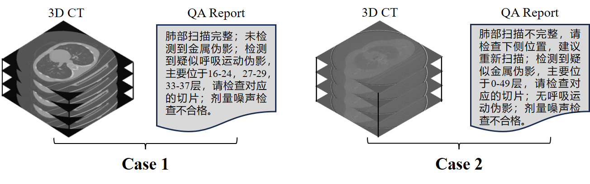
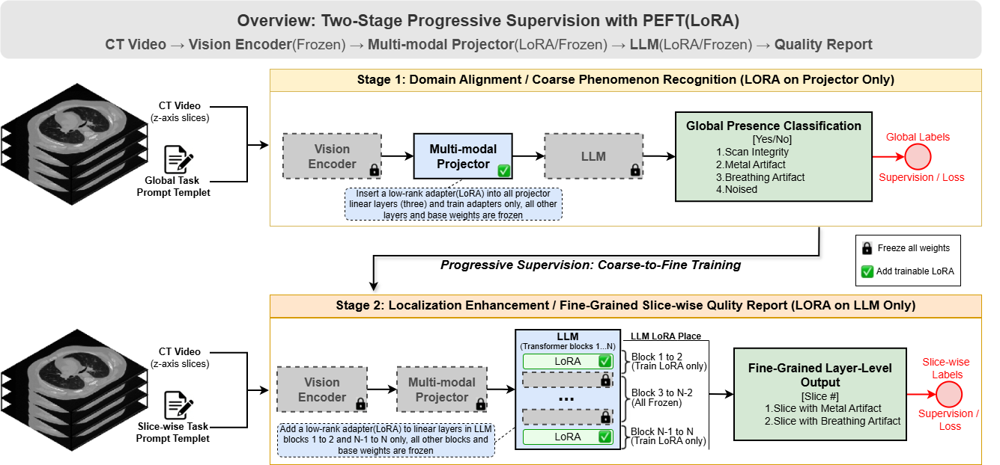

# CTQA-VLM
An efficient vision-language model for CT image quality assessment and reporting.

Here, we propose a CTQA-VLM algorithm that enables real-time generation of image quality assessment text reports from three-dimensional chest CT images. The quality control reports cover multiple issues, including incomplete scan coverage, artifacts, and noise. 

The input data:

The training algorithm:

## Citation

If you find CTQA-VLM useful for your research, please consider citing our work. 
The citation information will be updated upon publication.
